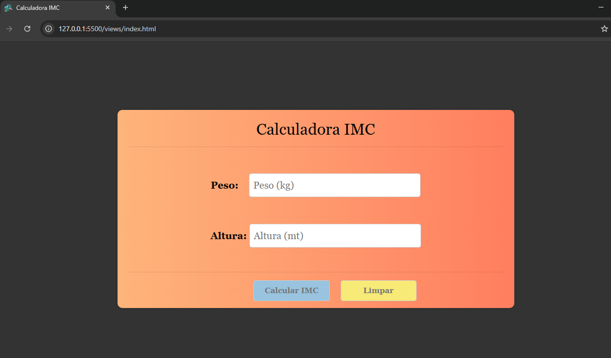

<h1 align="center"> 🧮 Calculadora IMC </h1>

<p align="center">
  
  
  
  
  
</p>

---

<br>

## 📖 Sobre o projeto
A **Calculadora IMC** é uma aplicação simples e responsiva que permite calcular o **Índice de Massa Corporal (IMC)** com base no peso e altura informados pelo usuário.  
Também fornece uma **classificação** de acordo com o resultado, seguindo as diretrizes da **OMS**.

---

## ✅ Funcionalidades
✔ Inserir **peso (kg)** e **altura (m)**  
✔ Calcular o **IMC** automaticamente  
✔ Exibir **classificação** (Abaixo do peso, Peso normal, Sobrepeso, Obesidade)  
✔ Interface responsiva e intuitiva  

---

## 🖥️ Demonstração
👉 **[Veja a demonstração online](#)** *(adicione aqui o link do GitHub Pages ou outra hospedagem)*  
📸 **Print do projeto:**  
<p align="center">
  
</p>

---

## 🛠️ Tecnologias utilizadas
- **HTML5** → Estrutura da página  
- **CSS3** → Estilização e responsividade  
- **JavaScript (ES6)** → Lógica de cálculo  

---

## 📂 Estrutura do projeto
```bash
calculadora-imc/

├── func
  └── index.js      # Lógica do cálculo IMC

├── public
  └── style.css     # Estilos aplicação + 'bootstrap'
  └── img           # Imagens da aplicação
  └── js            # Estilos 'bootstrap'

├── index.html      # Página principal
├── 
└── README.md       # Documentação do projeto
